Exploring U.S. Supreme Court Decisions
================
Benjamin Soltoff

## Get the data

``` r
# load useful packages
library(tidyverse)

# set default theme
theme_set(theme_minimal())
```

``` r
scdb_case
```

    ## # A tibble: 28,916 x 52
    ##    caseId docketId caseIssuesId dateDecision decisionType usCite sctCite ledCite
    ##    <chr>  <chr>    <chr>        <chr>               <dbl> <chr>  <lgl>   <chr>  
    ##  1 1791-… 1791-00… 1791-001-01… 8/3/1791                6 2 U.S… NA      1 L. E…
    ##  2 1791-… 1791-00… 1791-002-01… 8/3/1791                2 2 U.S… NA      1 L. E…
    ##  3 1792-… 1792-00… 1792-001-01… 2/14/1792               2 2 U.S… NA      1 L. E…
    ##  4 1792-… 1792-00… 1792-002-01… 8/7/1792                2 2 U.S… NA      1 L. E…
    ##  5 1792-… 1792-00… 1792-003-01… 8/11/1792               8 2 U.S… NA      1 L. E…
    ##  6 1792-… 1792-00… 1792-004-01… 8/11/1792               6 2 U.S… NA      1 L. E…
    ##  7 1793-… 1793-00… 1793-001-01… 2/19/1793               8 2 U.S… NA      1 L. E…
    ##  8 1793-… 1793-00… 1793-002-01… 2/20/1793               2 2 U.S… NA      1 L. E…
    ##  9 1793-… 1793-00… 1793-003-01… 2/20/1793               8 2 U.S… NA      1 L. E…
    ## 10 1794-… 1794-00… 1794-001-01… 2/7/1794               NA 3 U.S… NA      1 L. E…
    ## # … with 28,906 more rows, and 44 more variables: lexisCite <chr>, term <dbl>,
    ## #   naturalCourt <dbl>, chief <chr>, docket <lgl>, caseName <chr>,
    ## #   dateArgument <chr>, dateRearg <chr>, petitioner <dbl>,
    ## #   petitionerState <dbl>, respondent <dbl>, respondentState <dbl>,
    ## #   jurisdiction <dbl>, adminAction <lgl>, adminActionState <lgl>,
    ## #   threeJudgeFdc <dbl>, caseOrigin <dbl>, caseOriginState <dbl>,
    ## #   caseSource <dbl>, caseSourceState <dbl>, lcDisagreement <dbl>,
    ## #   certReason <dbl>, lcDisposition <dbl>, lcDispositionDirection <dbl>,
    ## #   declarationUncon <dbl>, caseDisposition <dbl>,
    ## #   caseDispositionUnusual <dbl>, partyWinning <dbl>,
    ## #   precedentAlteration <dbl>, voteUnclear <dbl>, issue <dbl>, issueArea <dbl>,
    ## #   decisionDirection <dbl>, decisionDirectionDissent <dbl>,
    ## #   authorityDecision1 <dbl>, authorityDecision2 <dbl>, lawType <dbl>,
    ## #   lawSupp <dbl>, lawMinor <chr>, majOpinWriter <dbl>, majOpinAssigner <dbl>,
    ## #   splitVote <dbl>, majVotes <dbl>, minVotes <dbl>

``` r
scdb_vote
```

    ## # A tibble: 253,058 x 13
    ##    caseId docketId caseIssuesId voteId  term justice justiceName  vote opinion
    ##    <chr>  <chr>    <chr>        <chr>  <dbl>   <dbl> <chr>       <dbl>   <dbl>
    ##  1 1791-… 1791-00… 1791-001-01… 1791-…  1791       1 JJay            1       1
    ##  2 1791-… 1791-00… 1791-001-01… 1791-…  1791       3 WCushing        1       1
    ##  3 1791-… 1791-00… 1791-001-01… 1791-…  1791       4 JWilson         1       1
    ##  4 1791-… 1791-00… 1791-001-01… 1791-…  1791       5 JBlair          1       1
    ##  5 1791-… 1791-00… 1791-001-01… 1791-…  1791       6 JIredell        1       1
    ##  6 1791-… 1791-00… 1791-002-01… 1791-…  1791       1 JJay            1       1
    ##  7 1791-… 1791-00… 1791-002-01… 1791-…  1791       3 WCushing        1       1
    ##  8 1791-… 1791-00… 1791-002-01… 1791-…  1791       4 JWilson         1       1
    ##  9 1791-… 1791-00… 1791-002-01… 1791-…  1791       5 JBlair          1       1
    ## 10 1791-… 1791-00… 1791-002-01… 1791-…  1791       6 JIredell        1       1
    ## # … with 253,048 more rows, and 4 more variables: direction <dbl>,
    ## #   majority <dbl>, firstAgreement <dbl>, secondAgreement <dbl>

## Recode variables as you find necessary

## What percentage of cases in each term are decided by a one-vote margin (i.e. 5-4, 4-3, etc.)

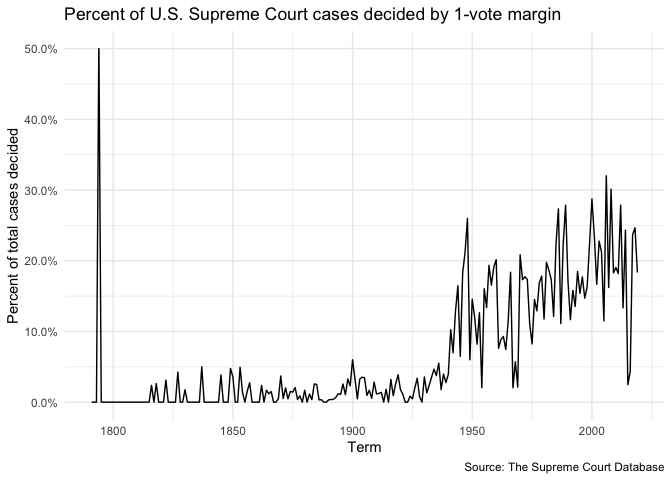<!-- -->

## For justices [currently serving on the Supreme Court](https://www.supremecourt.gov/about/biographies.aspx), how often have they voted in the conservative direction in cases involving criminal procedure, civil rights, economic activity, and federal taxation?

Organize the resulting graph by justice in descending order of
seniority. (Note that the chief justice is always considered the most
senior member of the court, regardless of appointment date.)

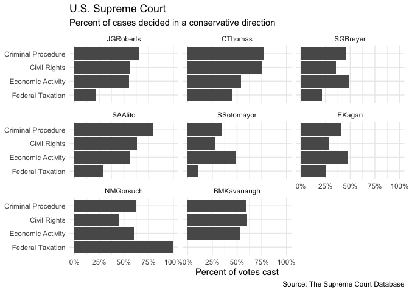<!-- -->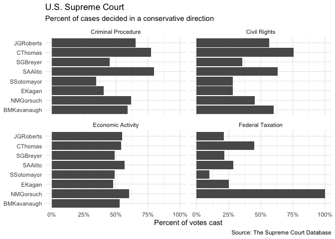<!-- -->

## In each term, how many of the term’s published decisions (decided after oral arguments) were announced in a given month?

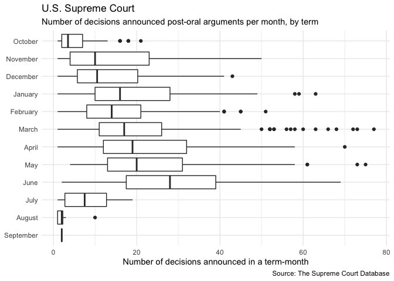<!-- -->

## Which justices are most likely to agree with with the Court’s declaration that an act of Congress, a state or territorial law, or a municipal ordinance is unconstitutional? Identify all cases where the Court declared something unconstitutional and determine the ten justices who most and least frequently agreed with this outcome as a percentage of all votes cast by the justice in these cases. Exclude any justice with fewer than 30 votes in cases where the Court’s outcome declares something unconstitutional.

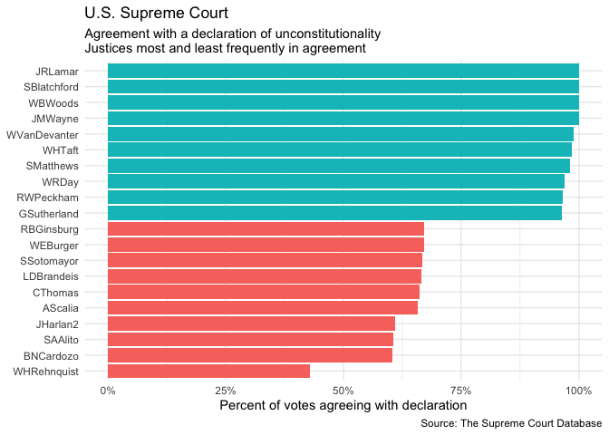<!-- -->

## In each term he served on the Court, in what percentage of cases was Justice Antonin Scalia in the majority?

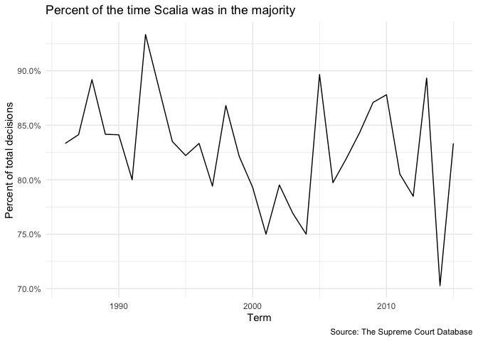<!-- -->

## Create a graph similar to above that adds a second component which compares the percentage for all cases versus non-unanimous cases (i.e. there was at least one dissenting vote)

### With two data frames

<!-- -->

### With a single data frame

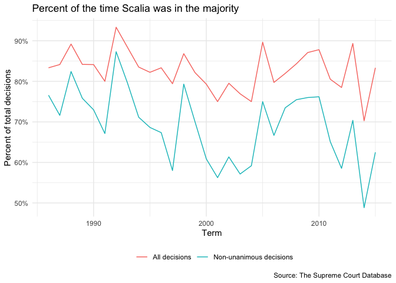<!-- -->

## In each term, what percentage of cases were decided in the conservative direction?

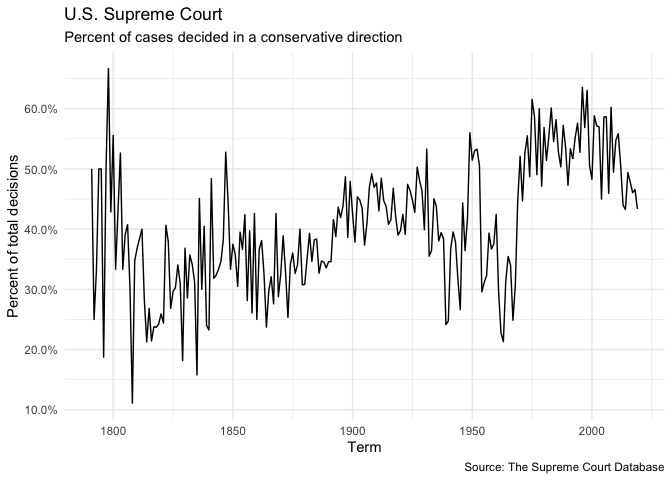<!-- -->

## The Chief Justice is frequently seen as capable of influencing the ideological direction of the Court. Create a graph similar to the one above that also incorporates information on who was the Chief Justice during the term.

#### Solution using facets (not too much more difficult)

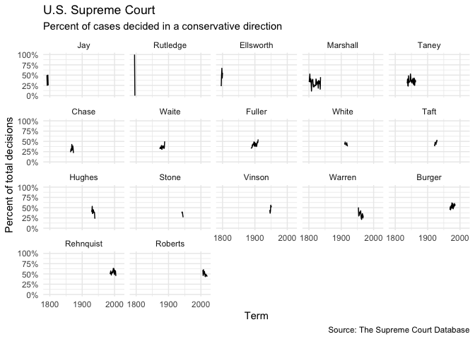<!-- -->

#### Solution using facets and showing whole data on each facet (getting harder)

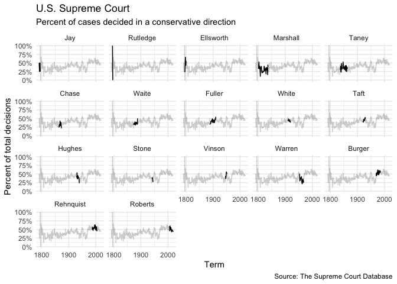<!-- -->

#### Solution shading original graph with color-coded eras of Chief Justices (attempt at your own risk)

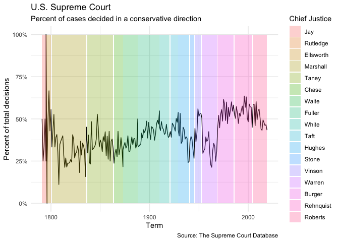<!-- -->

## Session info

``` r
devtools::session_info()
```

    ## ─ Session info ───────────────────────────────────────────────────────────────
    ##  setting  value                       
    ##  version  R version 4.0.2 (2020-06-22)
    ##  os       macOS Catalina 10.15.6      
    ##  system   x86_64, darwin17.0          
    ##  ui       X11                         
    ##  language (EN)                        
    ##  collate  en_US.UTF-8                 
    ##  ctype    en_US.UTF-8                 
    ##  tz       America/Chicago             
    ##  date     2020-09-23                  
    ## 
    ## ─ Packages ───────────────────────────────────────────────────────────────────
    ##  package     * version date       lib source        
    ##  assertthat    0.2.1   2019-03-21 [1] CRAN (R 4.0.0)
    ##  backports     1.1.7   2020-05-13 [1] CRAN (R 4.0.0)
    ##  blob          1.2.1   2020-01-20 [1] CRAN (R 4.0.0)
    ##  broom         0.5.6   2020-04-20 [1] CRAN (R 4.0.0)
    ##  callr         3.4.3   2020-03-28 [1] CRAN (R 4.0.0)
    ##  cellranger    1.1.0   2016-07-27 [1] CRAN (R 4.0.0)
    ##  cli           2.0.2   2020-02-28 [1] CRAN (R 4.0.0)
    ##  codetools     0.2-16  2018-12-24 [1] CRAN (R 4.0.2)
    ##  colorspace    1.4-1   2019-03-18 [1] CRAN (R 4.0.0)
    ##  crayon        1.3.4   2017-09-16 [1] CRAN (R 4.0.0)
    ##  DBI           1.1.0   2019-12-15 [1] CRAN (R 4.0.0)
    ##  dbplyr        1.4.4   2020-05-27 [1] CRAN (R 4.0.0)
    ##  desc          1.2.0   2018-05-01 [1] CRAN (R 4.0.0)
    ##  devtools      2.3.0   2020-04-10 [1] CRAN (R 4.0.0)
    ##  digest        0.6.25  2020-02-23 [1] CRAN (R 4.0.0)
    ##  dplyr       * 1.0.0   2020-05-29 [1] CRAN (R 4.0.0)
    ##  ellipsis      0.3.1   2020-05-15 [1] CRAN (R 4.0.0)
    ##  evaluate      0.14    2019-05-28 [1] CRAN (R 4.0.0)
    ##  fansi         0.4.1   2020-01-08 [1] CRAN (R 4.0.0)
    ##  farver        2.0.3   2020-01-16 [1] CRAN (R 4.0.0)
    ##  forcats     * 0.5.0   2020-03-01 [1] CRAN (R 4.0.0)
    ##  fs            1.4.1   2020-04-04 [1] CRAN (R 4.0.0)
    ##  generics      0.0.2   2018-11-29 [1] CRAN (R 4.0.0)
    ##  ggplot2     * 3.3.1   2020-05-28 [1] CRAN (R 4.0.0)
    ##  glue          1.4.1   2020-05-13 [1] CRAN (R 4.0.0)
    ##  gtable        0.3.0   2019-03-25 [1] CRAN (R 4.0.0)
    ##  haven         2.3.1   2020-06-01 [1] CRAN (R 4.0.0)
    ##  hms           0.5.3   2020-01-08 [1] CRAN (R 4.0.0)
    ##  htmltools     0.4.0   2019-10-04 [1] CRAN (R 4.0.0)
    ##  httr          1.4.1   2019-08-05 [1] CRAN (R 4.0.0)
    ##  jsonlite      1.7.0   2020-06-25 [1] CRAN (R 4.0.2)
    ##  knitr         1.29    2020-06-23 [1] CRAN (R 4.0.1)
    ##  labeling      0.3     2014-08-23 [1] CRAN (R 4.0.0)
    ##  lattice       0.20-41 2020-04-02 [1] CRAN (R 4.0.2)
    ##  lifecycle     0.2.0   2020-03-06 [1] CRAN (R 4.0.0)
    ##  lubridate   * 1.7.8   2020-04-06 [1] CRAN (R 4.0.0)
    ##  magrittr      1.5     2014-11-22 [1] CRAN (R 4.0.0)
    ##  memoise       1.1.0   2017-04-21 [1] CRAN (R 4.0.0)
    ##  modelr        0.1.8   2020-05-19 [1] CRAN (R 4.0.0)
    ##  munsell       0.5.0   2018-06-12 [1] CRAN (R 4.0.0)
    ##  nlme          3.1-148 2020-05-24 [1] CRAN (R 4.0.2)
    ##  pillar        1.4.6   2020-07-10 [1] CRAN (R 4.0.1)
    ##  pkgbuild      1.0.8   2020-05-07 [1] CRAN (R 4.0.0)
    ##  pkgconfig     2.0.3   2019-09-22 [1] CRAN (R 4.0.0)
    ##  pkgload       1.1.0   2020-05-29 [1] CRAN (R 4.0.0)
    ##  prettyunits   1.1.1   2020-01-24 [1] CRAN (R 4.0.0)
    ##  processx      3.4.2   2020-02-09 [1] CRAN (R 4.0.0)
    ##  ps            1.3.3   2020-05-08 [1] CRAN (R 4.0.0)
    ##  purrr       * 0.3.4   2020-04-17 [1] CRAN (R 4.0.0)
    ##  R6            2.4.1   2019-11-12 [1] CRAN (R 4.0.0)
    ##  Rcpp          1.0.5   2020-07-06 [1] CRAN (R 4.0.2)
    ##  readr       * 1.3.1   2018-12-21 [1] CRAN (R 4.0.0)
    ##  readxl        1.3.1   2019-03-13 [1] CRAN (R 4.0.0)
    ##  remotes       2.1.1   2020-02-15 [1] CRAN (R 4.0.0)
    ##  reprex        0.3.0   2019-05-16 [1] CRAN (R 4.0.0)
    ##  rlang         0.4.6   2020-05-02 [1] CRAN (R 4.0.1)
    ##  rmarkdown     2.3     2020-06-18 [1] CRAN (R 4.0.2)
    ##  rprojroot     1.3-2   2018-01-03 [1] CRAN (R 4.0.0)
    ##  rstudioapi    0.11    2020-02-07 [1] CRAN (R 4.0.0)
    ##  rvest         0.3.5   2019-11-08 [1] CRAN (R 4.0.0)
    ##  scales        1.1.1   2020-05-11 [1] CRAN (R 4.0.0)
    ##  sessioninfo   1.1.1   2018-11-05 [1] CRAN (R 4.0.0)
    ##  stringi       1.4.6   2020-02-17 [1] CRAN (R 4.0.0)
    ##  stringr     * 1.4.0   2019-02-10 [1] CRAN (R 4.0.0)
    ##  testthat      2.3.2   2020-03-02 [1] CRAN (R 4.0.0)
    ##  tibble      * 3.0.3   2020-07-10 [1] CRAN (R 4.0.1)
    ##  tidyr       * 1.1.0   2020-05-20 [1] CRAN (R 4.0.0)
    ##  tidyselect    1.1.0   2020-05-11 [1] CRAN (R 4.0.0)
    ##  tidyverse   * 1.3.0   2019-11-21 [1] CRAN (R 4.0.0)
    ##  usethis       1.6.1   2020-04-29 [1] CRAN (R 4.0.0)
    ##  utf8          1.1.4   2018-05-24 [1] CRAN (R 4.0.0)
    ##  vctrs         0.3.1   2020-06-05 [1] CRAN (R 4.0.1)
    ##  withr         2.2.0   2020-04-20 [1] CRAN (R 4.0.0)
    ##  xfun          0.15    2020-06-21 [1] CRAN (R 4.0.1)
    ##  xml2          1.3.2   2020-04-23 [1] CRAN (R 4.0.0)
    ##  yaml          2.2.1   2020-02-01 [1] CRAN (R 4.0.0)
    ## 
    ## [1] /Library/Frameworks/R.framework/Versions/4.0/Resources/library
