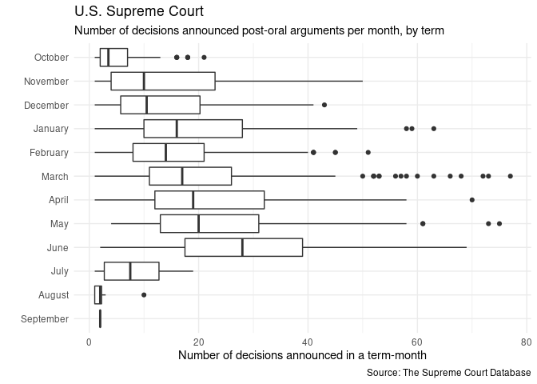
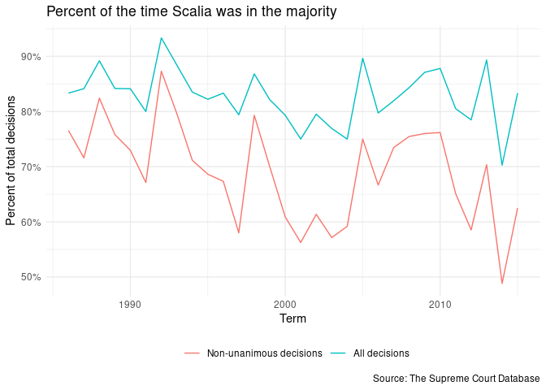
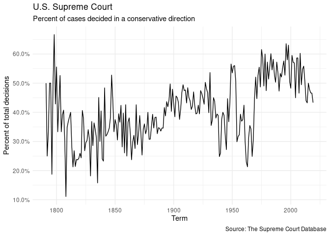
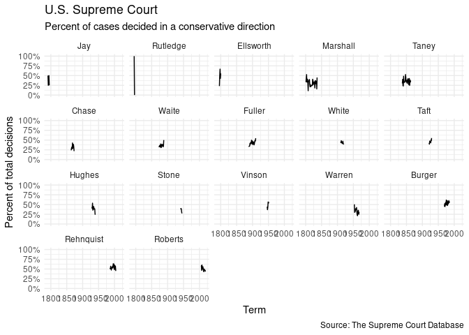
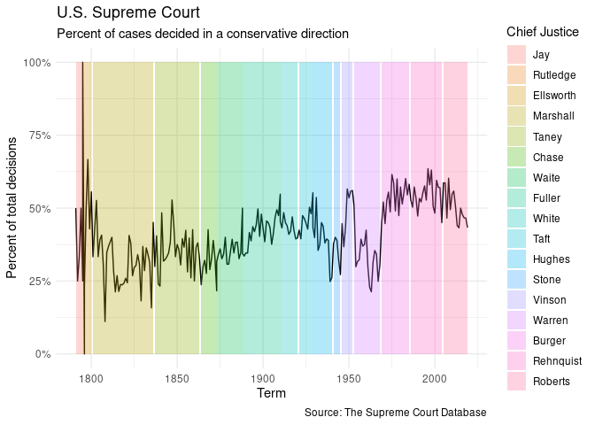

HW 3, pt. 2: Exploring U.S. Supreme Court Decisions
================
Julia Du

## Get the data

``` r
# load useful packages
library(tidyverse)
```

    ## ── Attaching packages ─────────────────────────────────────── tidyverse 1.3.0 ──

    ## ✓ ggplot2 3.3.3     ✓ purrr   0.3.4
    ## ✓ tibble  3.0.4     ✓ dplyr   1.0.2
    ## ✓ tidyr   1.1.2     ✓ stringr 1.4.0
    ## ✓ readr   1.4.0     ✓ forcats 0.5.0

    ## ── Conflicts ────────────────────────────────────────── tidyverse_conflicts() ──
    ## x dplyr::filter() masks stats::filter()
    ## x dplyr::lag()    masks stats::lag()

``` r
library(readr)
library(lubridate)
```

    ## 
    ## Attaching package: 'lubridate'

    ## The following objects are masked from 'package:base':
    ## 
    ##     date, intersect, setdiff, union

``` r
library(ggthemes)
library('scales')
```

    ## 
    ## Attaching package: 'scales'

    ## The following object is masked from 'package:purrr':
    ## 
    ##     discard

    ## The following object is masked from 'package:readr':
    ## 
    ##     col_factor

``` r
library(forcats)

theme_set(theme_solarized())

# load data
scdb_case <- read_csv("data/scdb-case.csv")
```

    ## 
    ## ── Column specification ────────────────────────────────────────────────────────
    ## cols(
    ##   .default = col_double(),
    ##   caseId = col_character(),
    ##   docketId = col_character(),
    ##   caseIssuesId = col_character(),
    ##   dateDecision = col_character(),
    ##   usCite = col_character(),
    ##   sctCite = col_logical(),
    ##   ledCite = col_character(),
    ##   lexisCite = col_character(),
    ##   chief = col_character(),
    ##   docket = col_logical(),
    ##   caseName = col_character(),
    ##   dateArgument = col_character(),
    ##   dateRearg = col_character(),
    ##   adminAction = col_logical(),
    ##   adminActionState = col_logical(),
    ##   lawMinor = col_character()
    ## )
    ## ℹ Use `spec()` for the full column specifications.

    ## Warning: 15270 parsing failures.
    ##   row     col           expected       actual                 file
    ## 19887 sctCite 1/0/T/F/TRUE/FALSE 67 S. Ct. 6  'data/scdb-case.csv'
    ## 19887 docket  1/0/T/F/TRUE/FALSE 24           'data/scdb-case.csv'
    ## 19888 sctCite 1/0/T/F/TRUE/FALSE 67 S. Ct. 13 'data/scdb-case.csv'
    ## 19888 docket  1/0/T/F/TRUE/FALSE 12           'data/scdb-case.csv'
    ## 19889 sctCite 1/0/T/F/TRUE/FALSE 67 S. Ct. 1  'data/scdb-case.csv'
    ## ..... ....... .................. ............ ....................
    ## See problems(...) for more details.

``` r
scdb_case
```

    ## # A tibble: 28,916 x 52
    ##    caseId docketId caseIssuesId dateDecision decisionType usCite sctCite ledCite
    ##    <chr>  <chr>    <chr>        <chr>               <dbl> <chr>  <lgl>   <chr>  
    ##  1 1791-… 1791-00… 1791-001-01… 8/3/1791                6 2 U.S… NA      1 L. E…
    ##  2 1791-… 1791-00… 1791-002-01… 8/3/1791                2 2 U.S… NA      1 L. E…
    ##  3 1792-… 1792-00… 1792-001-01… 2/14/1792               2 2 U.S… NA      1 L. E…
    ##  4 1792-… 1792-00… 1792-002-01… 8/7/1792                2 2 U.S… NA      1 L. E…
    ##  5 1792-… 1792-00… 1792-003-01… 8/11/1792               8 2 U.S… NA      1 L. E…
    ##  6 1792-… 1792-00… 1792-004-01… 8/11/1792               6 2 U.S… NA      1 L. E…
    ##  7 1793-… 1793-00… 1793-001-01… 2/19/1793               8 2 U.S… NA      1 L. E…
    ##  8 1793-… 1793-00… 1793-002-01… 2/20/1793               2 2 U.S… NA      1 L. E…
    ##  9 1793-… 1793-00… 1793-003-01… 2/20/1793               8 2 U.S… NA      1 L. E…
    ## 10 1794-… 1794-00… 1794-001-01… 2/7/1794               NA 3 U.S… NA      1 L. E…
    ## # … with 28,906 more rows, and 44 more variables: lexisCite <chr>, term <dbl>,
    ## #   naturalCourt <dbl>, chief <chr>, docket <lgl>, caseName <chr>,
    ## #   dateArgument <chr>, dateRearg <chr>, petitioner <dbl>,
    ## #   petitionerState <dbl>, respondent <dbl>, respondentState <dbl>,
    ## #   jurisdiction <dbl>, adminAction <lgl>, adminActionState <lgl>,
    ## #   threeJudgeFdc <dbl>, caseOrigin <dbl>, caseOriginState <dbl>,
    ## #   caseSource <dbl>, caseSourceState <dbl>, lcDisagreement <dbl>,
    ## #   certReason <dbl>, lcDisposition <dbl>, lcDispositionDirection <dbl>,
    ## #   declarationUncon <dbl>, caseDisposition <dbl>,
    ## #   caseDispositionUnusual <dbl>, partyWinning <dbl>,
    ## #   precedentAlteration <dbl>, voteUnclear <dbl>, issue <dbl>, issueArea <dbl>,
    ## #   decisionDirection <dbl>, decisionDirectionDissent <dbl>,
    ## #   authorityDecision1 <dbl>, authorityDecision2 <dbl>, lawType <dbl>,
    ## #   lawSupp <dbl>, lawMinor <chr>, majOpinWriter <dbl>, majOpinAssigner <dbl>,
    ## #   splitVote <dbl>, majVotes <dbl>, minVotes <dbl>

``` r
scdb_vote <- read_csv("data/scdb-vote.csv")
```

    ## 
    ## ── Column specification ────────────────────────────────────────────────────────
    ## cols(
    ##   caseId = col_character(),
    ##   docketId = col_character(),
    ##   caseIssuesId = col_character(),
    ##   voteId = col_character(),
    ##   term = col_double(),
    ##   justice = col_double(),
    ##   justiceName = col_character(),
    ##   vote = col_double(),
    ##   opinion = col_double(),
    ##   direction = col_double(),
    ##   majority = col_double(),
    ##   firstAgreement = col_double(),
    ##   secondAgreement = col_double()
    ## )

``` r
scdb_vote
```

    ## # A tibble: 253,058 x 13
    ##    caseId docketId caseIssuesId voteId  term justice justiceName  vote opinion
    ##    <chr>  <chr>    <chr>        <chr>  <dbl>   <dbl> <chr>       <dbl>   <dbl>
    ##  1 1791-… 1791-00… 1791-001-01… 1791-…  1791       1 JJay            1       1
    ##  2 1791-… 1791-00… 1791-001-01… 1791-…  1791       3 WCushing        1       1
    ##  3 1791-… 1791-00… 1791-001-01… 1791-…  1791       4 JWilson         1       1
    ##  4 1791-… 1791-00… 1791-001-01… 1791-…  1791       5 JBlair          1       1
    ##  5 1791-… 1791-00… 1791-001-01… 1791-…  1791       6 JIredell        1       1
    ##  6 1791-… 1791-00… 1791-002-01… 1791-…  1791       1 JJay            1       1
    ##  7 1791-… 1791-00… 1791-002-01… 1791-…  1791       3 WCushing        1       1
    ##  8 1791-… 1791-00… 1791-002-01… 1791-…  1791       4 JWilson         1       1
    ##  9 1791-… 1791-00… 1791-002-01… 1791-…  1791       5 JBlair          1       1
    ## 10 1791-… 1791-00… 1791-002-01… 1791-…  1791       6 JIredell        1       1
    ## # … with 253,048 more rows, and 4 more variables: direction <dbl>,
    ## #   majority <dbl>, firstAgreement <dbl>, secondAgreement <dbl>

## Recode variables as you find necessary

I decided not to recode variables at the beginning. If I needed to
recode anything for a question, I did it within the assigned code chunk.

## What percentage of cases in each term are decided by a one-vote margin (i.e. 5-4, 4-3, etc.)

**Note:** Whenever I mutate a new variable with “lgl” as a suffix,
that’s a note to myself that I’m creating a logical variable (which I
then use to find a %). For most of this HW, I prefer mutating a new
logical var instead of mutating a recoded var, but I do mutate a recoded
variable in Q8 to show that these 2 methods give me the same answer.

**Also,** throughout my mutation of logical/recoded variables in this
HW, I often summarize to find the total counts alongside the mean
(i.e. the percentages). For most questions, the total counts aren’t
needed for the answer, but I’ve kept them in because they are useful in
checking my work.

``` r
scdb_case %>%
  drop_na(term, majVotes, minVotes) %>%
  group_by(term) %>%
  mutate(V_margin = majVotes-minVotes) %>%
  mutate(onevotelgl = (V_margin == 1)) %>%
  summarize(
   # totalcases = n(),
    onevote = mean(onevotelgl)
  ) %>%
 ggplot(mapping = aes(x = term, y = onevote)) +
  geom_line() +
  labs(title = "Percent of U.S. Supreme Court cases decided by 1-vote margin", x = "Term", y = "Percent of total cases decided", caption = "Source: The Supreme Court Database") +
 scale_y_continuous(labels = scales::percent) 
```

    ## `summarise()` ungrouping output (override with `.groups` argument)

<!-- -->

## For justices [currently serving on the Supreme Court](https://www.supremecourt.gov/about/biographies.aspx), how often have they voted in the conservative direction in cases involving criminal procedure, civil rights, economic activity, and federal taxation?

Organize the resulting graph by justice in descending order of
seniority. (Note that the chief justice is always considered the most
senior member of the court, regardless of appointment date.)

``` r
require(forcats)

issueArea_names <- c(
                    `1` = "Criminal Procedure",
                    `2` = "Civil Rights",
                    `8` = "Economic Activity",
                    `12` = "Federal Taxation"
                                        )
justice_levels <- c("JGRoberts", "CThomas", "SGBreyer", "SAAlito", "SSotomayor", "EKagan", "NMGorsuch", "BMKavanaugh") 
#This dataset is for the 1791-2019 SCOTUS terms, which each start in October. 
#Though she is currently serving, Amy Coney Barrett isn't in this dataset (she was sworn in Oct. 2020) so I left her out.

#facet by issueArea 
#note: this method is not as efficient as my "facet by justiceName" chunk below, but I wanted to keep this code since it goes through my thought process step-by-step
scdb_case %>%
  drop_na(issueArea) %>%
  group_by(issueArea) %>%
  filter(
    issueArea %in% c(1, 2, 8, 12)
    ) %>%
  select(caseIssuesId, issueArea) %>%
   right_join(scdb_vote, by = "caseIssuesId") %>%
mutate(OrderjusticeName = fct_relevel(justiceName, justice_levels)) %>% 
    group_by(OrderjusticeName, issueArea) %>%
   filter(
    OrderjusticeName %in% c("JGRoberts", "CThomas", "SGBreyer", "SAAlito", "SSotomayor", "EKagan", "NMGorsuch", "BMKavanaugh")
    ) %>%
  drop_na(direction, issueArea) %>%  
      mutate(conservlgl = (direction == 1)) %>%
  summarize(
    totalvotes = n(),
    conserv = mean(conservlgl)
  ) %>%
  ggplot(mapping = aes(x = conserv, y = fct_rev(OrderjusticeName))) + 
  geom_bar(stat = 'identity') +
  labs(title = "US Supreme Court", subtitle = "Percent of cases decided in a conservative direction", x = "Percent of votes cast", y = " ", caption = "Source: The Supreme Court Database") +
 scale_x_continuous(labels = scales::percent) +
  facet_wrap(issueArea ~ ., labeller = as_labeller(issueArea_names)) 
```

    ## `summarise()` regrouping output by 'OrderjusticeName' (override with `.groups` argument)

<!-- -->

``` r
#facet by justice
scdb_case %>%
  select(caseIssuesId, issueArea) %>%
   right_join(scdb_vote, by = "caseIssuesId") %>%
mutate(OrderjusticeName = fct_relevel(justiceName, justice_levels)) %>% ###delete if this doesn't work
  drop_na(direction, issueArea, OrderjusticeName) %>%  
     filter(
    issueArea %in% c(1, 2, 8, 12),
    OrderjusticeName %in% c("JGRoberts", "CThomas", "SGBreyer", "SAAlito", "SSotomayor", "EKagan", "NMGorsuch", "BMKavanaugh")
    ) %>%
  group_by(OrderjusticeName, issueArea) %>%
      mutate(conservlgl = (direction == 1)) %>%
  summarize(
    conserv = mean(conservlgl)
  ) %>%
 mutate(issueArea = factor(issueArea, labels = issueArea_names)) %>%
  ggplot(mapping = aes(x = conserv, y = fct_rev(issueArea))) +
  geom_col() +
  labs(title = "US Supreme Court", subtitle = "Percent of cases decided in a conservative direction", x = "Percent of votes cast", y = "", caption = "Source: The Supreme Court Database") +
 scale_x_continuous(labels = scales::percent) +
  facet_wrap(OrderjusticeName ~ .) 
```

    ## `summarise()` regrouping output by 'OrderjusticeName' (override with `.groups` argument)

<!-- -->

## In each term, how many of the term’s published decisions (decided after oral arguments) were announced in a given month?

``` r
trymonth = c(` ` = month.name) 

scdb_case %>%
  mutate(date_parsed = mdy(dateDecision)) %>%
  mutate(month_announce = month(date_parsed)) %>%
  mutate(month_announce = factor(month_announce, labels = trymonth)) %>%
    drop_na(term, month_announce, decisionType) %>%
#  select(term, month_announce, decisionType) %>%
  filter(decisionType %in% c(1, 6, 7)) %>% #filtering only for cases that were orally argued
  group_by(term, month_announce) %>%
    count(month_announce) %>%
  mutate(month_announce = factor(month_announce, levels = month.name)) %>%
    mutate(month_announce = fct_shift(month_announce, n = -3)) %>%
 ggplot() +
    geom_boxplot(mapping = aes(x = n, y = fct_rev(month_announce))) +
    labs(title = "U.S. Supreme Court", subtitle = "Number of decisions announced post-oral arguments per month, by term", x = "Number of decisions announced in a term-month", y = "", caption = "Source: The Supreme Court Database") 
```

<!-- -->

## Which justices are most likely to agree with with the Court’s declaration that an act of Congress, a state or territorial law, or a municipal ordinance is unconstitutional? Identify all cases where the Court declared something unconstitutional and determine the ten justices who most and least frequently agreed with this outcome as a percentage of all votes cast by the justice in these cases. Exclude any justice with fewer than 30 votes in cases where the Court’s outcome declares something unconstitutional.

``` r
scdb_case %>%
  group_by(declarationUncon) %>%
  filter(
    declarationUncon > 1
    ) %>%
  select(caseIssuesId, declarationUncon) %>%
   right_join(scdb_vote, by = "caseIssuesId") %>%  
   group_by(justiceName) %>%
  drop_na(majority, justiceName, declarationUncon) %>%  
  mutate(yes_unconlgl = (majority == 2)) %>%
  summarize(
    vote_uncon = n(),
    yes_uncon = mean(yes_unconlgl)
  ) %>%
  filter(vote_uncon >= 30) %>%
  arrange(-yes_uncon) %>%
  slice(1:10, 71:80) %>%
  mutate(type = ifelse(yes_uncon>0.90, "top", "bottom")) %>% 
  ggplot(mapping = aes(x = yes_uncon, y = fct_reorder(justiceName, .x = yes_uncon), fill = type)) +
  geom_col() +
  scale_x_continuous(labels = scales::percent) +
  labs(title = "U.S. Supreme Court", subtitle = "Agreement with a declaration of unconstitutionality \n Justices most and least frequently in agreement", x = "Percent of votes agreeing with declaration", y = "", caption = "Source: The Supreme Court Database") +
  theme_bw() +
    theme(legend.position = "none")
```

    ## `summarise()` ungrouping output (override with `.groups` argument)

<!-- -->

## In each term he served on the Court, in what percentage of cases was Justice Antonin Scalia in the majority?

``` r
scdb_vote %>%
    filter(
    justiceName == "AScalia"
    ) %>%
  group_by(term) %>%
  drop_na(majority, justiceName, term) %>%  
  mutate(Scalia_majlgl = (majority == 2)) %>%
  summarize(
    totalScalia_maj = n(),
    Scalia_maj = mean(Scalia_majlgl)
  ) %>%
 ggplot(mapping = aes(x = term, y = Scalia_maj)) +
  geom_line() +
  labs(title = "Percent of the time Scalia was in the majority", x = "Term", y = "Percent of total decisions", caption = "Source: The Supreme Court Database") +
 scale_y_continuous(labels = scales::percent) 
```

    ## `summarise()` ungrouping output (override with `.groups` argument)

<!-- -->

## Create a graph similar to above that adds a second component which compares the percentage for all cases versus non-unanimous cases (i.e. there was at least one dissenting vote)

``` r
alldecisions <- scdb_vote %>%
    filter(
    justiceName == "AScalia"
    ) %>%
  group_by(term) %>%
  drop_na(majority, justiceName, term) %>%  
  mutate(Scalia_majlgl = (majority == 2)) %>%
  summarize(
    totalScalia_maj = n(),
    Scalia_maj = mean(Scalia_majlgl)
  )
```

    ## `summarise()` ungrouping output (override with `.groups` argument)

``` r
nonall_decisions <-  
  scdb_case %>%
  select(caseIssuesId, minVotes) %>%
  right_join(scdb_vote, by = "caseIssuesId") %>%
  drop_na(minVotes, majority, justiceName, term) %>%
  filter(
    minVotes != "0",
    justiceName == "AScalia"
    ) %>%
  group_by(term) %>%
  mutate(dis_Scalia_majlgl = (majority == 2)) %>%
  summarize(
#    dis_totalScalia_maj = n(),
    dis_Scalia_maj = mean(dis_Scalia_majlgl)
  ) 
```

    ## `summarise()` ungrouping output (override with `.groups` argument)

``` r
#plotting w/ 2 dataframes
Scaliacolors <- c("All decisions" = "blue", "Non-unanimous decisions" = "red")

ggplot() +
  geom_line(data = alldecisions, mapping = aes(x = term, y = Scalia_maj, color = "All decisions")) +
  geom_line(data = nonall_decisions, mapping = aes(x = term, y = dis_Scalia_maj, color = "Non-unanimous decisions")) +
  labs(title = "Percent of the time Scalia was in the majority", x = "Term", y = "Percent of total decisions", caption = "Source: The Supreme Court Database", color = "Legend") +
  scale_color_manual(values = Scaliacolors) +
 scale_y_continuous(labels = scales::percent) +
  theme_bw() +
  theme(legend.position="bottom")
```

<!-- -->

``` r
#plotting w/ 1 dataframe
alldecisions %>%
  inner_join(nonall_decisions, by = "term") %>%
  pivot_longer(cols = c(Scalia_maj, dis_Scalia_maj), names_to = "type", values_to = "percentage") %>%
ggplot(mapping = aes(x = term, y = percentage, color = type)) +
  geom_line() +
  labs(title = "Percent of the time Scalia was in the majority", x = "Term", y = "Percent of total decisions", caption = "Source: The Supreme Court Database", color = "Legend") +
 scale_y_continuous(labels = scales::percent) +
  scale_color_discrete(labels = c("Non-unanimous decisions", "All decisions")) +
   theme_bw() +
  theme(legend.position="bottom")
```

<!-- -->

## In each term, what percentage of cases were decided in the conservative direction?

``` r
scdb_case %>%
  drop_na(term, decisionDirection) %>%
  group_by(term) %>%
  mutate(conserv_caselgl = (decisionDirection == 1)) %>%
  summarize(
 #   totalconserv_cases = n(),
    conserv_case = mean(conserv_caselgl)
  ) %>%
 ggplot(mapping = aes(x = term, y = conserv_case)) +
  geom_line() +
  labs(title = "U.S. Supreme Court", subtitle = "Percent of cases decided in a conservative direction", x = "Term", y = "Percent of total decisions", caption = "Source: The Supreme Court Database") +
 scale_y_continuous(labels = scales::percent) 
```

    ## `summarise()` ungrouping output (override with `.groups` argument)

<!-- -->

## The Chief Justice is frequently seen as capable of influencing the ideological direction of the Court. Create a graph similar to the one above that also incorporates information on who was the Chief Justice during the term.

**Note:** This time, to find % for the basic facet graph (i.e. you ony
see a justice’s individual term), I mutated a recoded variable instead
of mutating a new logical variable (which has been my preferred method
throughout this HW).

*I can still find % with a logical variable* (& I do so under the
trychief\_facet code chunk, when finding the facet graph with opaque all
terms), but I wanted to show that I can use this method as well - and
that these 2 methods give me the same answer.

``` r
chief_levels = c("Jay", "Rutledge", "Ellsworth", "Marshall", "Taney", "Chase", "Waite", "Fuller", "White", "Taft", "Hughes", "Stone", "Vinson", "Warren", "Burger", "Rehnquist", "Roberts") 

#basic graph (only see justice's individual terms)
scdb_case %>%
  mutate(Orderchief = fct_relevel(chief, chief_levels)) %>%
  drop_na(term, decisionDirection, Orderchief) %>%
   group_by(term, Orderchief) %>%
    mutate(Recode_decDirect = ifelse(decisionDirection != "1", 0, 1)) %>% #do this != to ensure we account for unspecified
    summarize(
#    totalconserv_cases = n(),
    conserv_case = mean(Recode_decDirect, na.rm = TRUE)
  ) %>%
  ggplot(mapping = aes(x = term, y = conserv_case)) +
  geom_line() +
 facet_wrap(Orderchief ~ .) +
  labs(title = "U.S. Supreme Court", subtitle = "Percent of cases decided in a conservative direction", x = "Term", y = "Percent of total decisions", caption = "Source: The Supreme Court Database") +
 scale_y_continuous(labels = scales::percent) +
  theme_bw()
```

    ## `summarise()` regrouping output by 'term' (override with `.groups` argument)

<!-- -->

``` r
#facet graph (with opaque all terms)
fullchief_facet <- scdb_case %>%
  drop_na(term, decisionDirection) %>%
  group_by(term, chief) %>% #we keep this as chief & don't switch to Orderchief so that faceting by Orderchief works later
  mutate(conserv_caselgl = (decisionDirection == 1)) %>%
  summarize(
#    totalconserv_cases = n(),
    conserv_case1 = mean(conserv_caselgl)
  ) 
```

    ## `summarise()` regrouping output by 'term' (override with `.groups` argument)

``` r
trychief_facet <- scdb_case %>%
  mutate(Orderchief = fct_relevel(chief, chief_levels)) %>%
  drop_na(term, decisionDirection, Orderchief) %>%
   group_by(term, Orderchief) %>%
  mutate(conserv_caselgl = (decisionDirection == 1)) %>%
  summarize(
#    totalconserv_cases = n(),
    conserv_case = mean(conserv_caselgl, na.rm = TRUE)
  )
```

    ## `summarise()` regrouping output by 'term' (override with `.groups` argument)

``` r
ggplot() +
 geom_line(data = fullchief_facet, mapping = aes(x = term, y = conserv_case1), alpha = 0.1) +
    geom_line(data = trychief_facet, mapping = aes(x = term, y = conserv_case), color = "red") +
  facet_wrap(Orderchief ~ .) +
 labs(title = "U.S. Supreme Court", subtitle = "Percent of cases decided in a conservative direction", x = "Term", y = "Percent of total decisions", caption = "Source: The Supreme Court Database") +
   scale_y_continuous(labels = scales::percent) +
  theme_bw() +
  theme(legend.position = "none")
```

<!-- -->

``` r
#chief shade graph
##to get % for all terms
trychief_facetline <- trychief_facet %>% 
  ggplot(mapping = aes(x = term, y = conserv_case)) +
  geom_line() +
  labs(title = "U.S. Supreme Court", subtitle = "Percent of cases decided in a conservative direction", x = "Term", y = "Percent of total decisions", caption = "Source: The Supreme Court Database") +
 scale_y_continuous(labels = scales::percent) 

##to get shading by Chief Justice
chief_facet <- scdb_case %>%
 mutate(Orderchief = fct_relevel(chief, chief_levels)) %>%
  distinct(term, Orderchief) %>%
  group_by(Orderchief) %>%
  mutate(xmin = min(term), xmax = max(term)) %>%
  select(-term) %>%
  distinct() %>%
  mutate(ymin = min(trychief_facet$conserv_case), ymax = max(trychief_facet$conserv_case))

trychief_facetline + 
  geom_rect(data = chief_facet, mapping = aes(NULL, NULL, xmin = xmin, xmax = xmax, ymin = ymin, ymax = ymax, fill = Orderchief), alpha = 0.2) +
  labs(fill = "Chief Justice") +
  theme_bw()
```

<!-- -->

## Session info

``` r
devtools::session_info()
```

    ## ─ Session info ───────────────────────────────────────────────────────────────
    ##  setting  value                               
    ##  version  R version 4.0.1 (2020-06-06)        
    ##  os       Red Hat Enterprise Linux 8.3 (Ootpa)
    ##  system   x86_64, linux-gnu                   
    ##  ui       X11                                 
    ##  language (EN)                                
    ##  collate  en_US.UTF-8                         
    ##  ctype    en_US.UTF-8                         
    ##  tz       America/Chicago                     
    ##  date     2021-01-30                          
    ## 
    ## ─ Packages ───────────────────────────────────────────────────────────────────
    ##  package     * version date       lib source        
    ##  assertthat    0.2.1   2019-03-21 [2] CRAN (R 4.0.1)
    ##  backports     1.2.1   2020-12-09 [2] CRAN (R 4.0.1)
    ##  broom         0.7.3   2020-12-16 [2] CRAN (R 4.0.1)
    ##  callr         3.5.1   2020-10-13 [2] CRAN (R 4.0.1)
    ##  cellranger    1.1.0   2016-07-27 [2] CRAN (R 4.0.1)
    ##  cli           2.2.0   2020-11-20 [2] CRAN (R 4.0.1)
    ##  colorspace    2.0-0   2020-11-11 [2] CRAN (R 4.0.1)
    ##  crayon        1.3.4   2017-09-16 [2] CRAN (R 4.0.1)
    ##  DBI           1.1.0   2019-12-15 [2] CRAN (R 4.0.1)
    ##  dbplyr        2.0.0   2020-11-03 [2] CRAN (R 4.0.1)
    ##  desc          1.2.0   2018-05-01 [2] CRAN (R 4.0.1)
    ##  devtools      2.3.2   2020-09-18 [1] CRAN (R 4.0.1)
    ##  digest        0.6.27  2020-10-24 [2] CRAN (R 4.0.1)
    ##  dplyr       * 1.0.2   2020-08-18 [2] CRAN (R 4.0.1)
    ##  ellipsis      0.3.1   2020-05-15 [2] CRAN (R 4.0.1)
    ##  evaluate      0.14    2019-05-28 [2] CRAN (R 4.0.1)
    ##  fansi         0.4.1   2020-01-08 [2] CRAN (R 4.0.1)
    ##  farver        2.0.3   2020-01-16 [2] CRAN (R 4.0.1)
    ##  forcats     * 0.5.0   2020-03-01 [2] CRAN (R 4.0.1)
    ##  fs            1.5.0   2020-07-31 [2] CRAN (R 4.0.1)
    ##  generics      0.1.0   2020-10-31 [2] CRAN (R 4.0.1)
    ##  ggplot2     * 3.3.3   2020-12-30 [2] CRAN (R 4.0.1)
    ##  ggthemes    * 4.2.4   2021-01-20 [1] CRAN (R 4.0.1)
    ##  glue          1.4.2   2020-08-27 [2] CRAN (R 4.0.1)
    ##  gtable        0.3.0   2019-03-25 [2] CRAN (R 4.0.1)
    ##  haven         2.3.1   2020-06-01 [2] CRAN (R 4.0.1)
    ##  hms           0.5.3   2020-01-08 [2] CRAN (R 4.0.1)
    ##  htmltools     0.4.0   2019-10-04 [2] CRAN (R 4.0.1)
    ##  httr          1.4.2   2020-07-20 [2] CRAN (R 4.0.1)
    ##  jsonlite      1.7.2   2020-12-09 [2] CRAN (R 4.0.1)
    ##  knitr         1.30    2020-09-22 [2] CRAN (R 4.0.1)
    ##  labeling      0.4.2   2020-10-20 [2] CRAN (R 4.0.1)
    ##  lifecycle     0.2.0   2020-03-06 [2] CRAN (R 4.0.1)
    ##  lubridate   * 1.7.9.2 2020-11-13 [2] CRAN (R 4.0.1)
    ##  magrittr      2.0.1   2020-11-17 [2] CRAN (R 4.0.1)
    ##  memoise       1.1.0   2017-04-21 [2] CRAN (R 4.0.1)
    ##  modelr        0.1.8   2020-05-19 [2] CRAN (R 4.0.1)
    ##  munsell       0.5.0   2018-06-12 [2] CRAN (R 4.0.1)
    ##  pillar        1.4.7   2020-11-20 [2] CRAN (R 4.0.1)
    ##  pkgbuild      1.2.0   2020-12-15 [2] CRAN (R 4.0.1)
    ##  pkgconfig     2.0.3   2019-09-22 [2] CRAN (R 4.0.1)
    ##  pkgload       1.1.0   2020-05-29 [2] CRAN (R 4.0.1)
    ##  prettyunits   1.1.1   2020-01-24 [2] CRAN (R 4.0.1)
    ##  processx      3.4.5   2020-11-30 [2] CRAN (R 4.0.1)
    ##  ps            1.5.0   2020-12-05 [2] CRAN (R 4.0.1)
    ##  purrr       * 0.3.4   2020-04-17 [2] CRAN (R 4.0.1)
    ##  R6            2.5.0   2020-10-28 [2] CRAN (R 4.0.1)
    ##  Rcpp          1.0.5   2020-07-06 [2] CRAN (R 4.0.1)
    ##  readr       * 1.4.0   2020-10-05 [2] CRAN (R 4.0.1)
    ##  readxl        1.3.1   2019-03-13 [2] CRAN (R 4.0.1)
    ##  remotes       2.2.0   2020-07-21 [2] CRAN (R 4.0.1)
    ##  reprex        0.3.0   2019-05-16 [1] CRAN (R 4.0.1)
    ##  rlang         0.4.10  2020-12-30 [2] CRAN (R 4.0.1)
    ##  rmarkdown     2.6     2020-12-14 [2] CRAN (R 4.0.1)
    ##  rprojroot     2.0.2   2020-11-15 [2] CRAN (R 4.0.1)
    ##  rstudioapi    0.13    2020-11-12 [2] CRAN (R 4.0.1)
    ##  rvest         0.3.6   2020-07-25 [2] CRAN (R 4.0.1)
    ##  scales      * 1.1.1   2020-05-11 [2] CRAN (R 4.0.1)
    ##  sessioninfo   1.1.1   2018-11-05 [2] CRAN (R 4.0.1)
    ##  stringi       1.5.3   2020-09-09 [2] CRAN (R 4.0.1)
    ##  stringr     * 1.4.0   2019-02-10 [2] CRAN (R 4.0.1)
    ##  testthat      3.0.1   2020-12-17 [2] CRAN (R 4.0.1)
    ##  tibble      * 3.0.4   2020-10-12 [2] CRAN (R 4.0.1)
    ##  tidyr       * 1.1.2   2020-08-27 [2] CRAN (R 4.0.1)
    ##  tidyselect    1.1.0   2020-05-11 [2] CRAN (R 4.0.1)
    ##  tidyverse   * 1.3.0   2019-11-21 [1] CRAN (R 4.0.1)
    ##  usethis       2.0.0   2020-12-10 [1] CRAN (R 4.0.1)
    ##  utf8          1.1.4   2018-05-24 [2] CRAN (R 4.0.1)
    ##  vctrs         0.3.6   2020-12-17 [2] CRAN (R 4.0.1)
    ##  withr         2.3.0   2020-09-22 [2] CRAN (R 4.0.1)
    ##  xfun          0.19    2020-10-30 [2] CRAN (R 4.0.1)
    ##  xml2          1.3.2   2020-04-23 [2] CRAN (R 4.0.1)
    ##  yaml          2.2.1   2020-02-01 [2] CRAN (R 4.0.1)
    ## 
    ## [1] /home/duj/R/x86_64-pc-linux-gnu-library/4.0
    ## [2] /opt/R/4.0.1/lib/R/library
